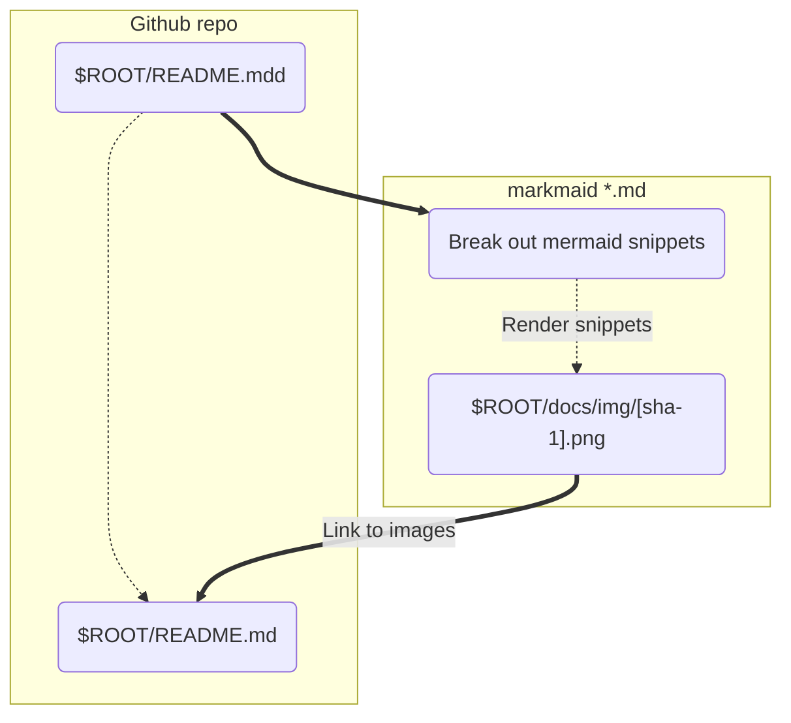

# markmaid

CLI tool that parses markdown files and renders mermaid snippets as images.

## How it works

1. Create a readme file with mermaid code snippet (for example, see the [readme source for
   this project](docs/README.md)).
2. Run `markmaid [filename]`
3. Commit and push
4. View the rendered result in your Github docs



## Installation

Install the markmaid command line tool with npm:

```sh
npm install -g mermaid
```
