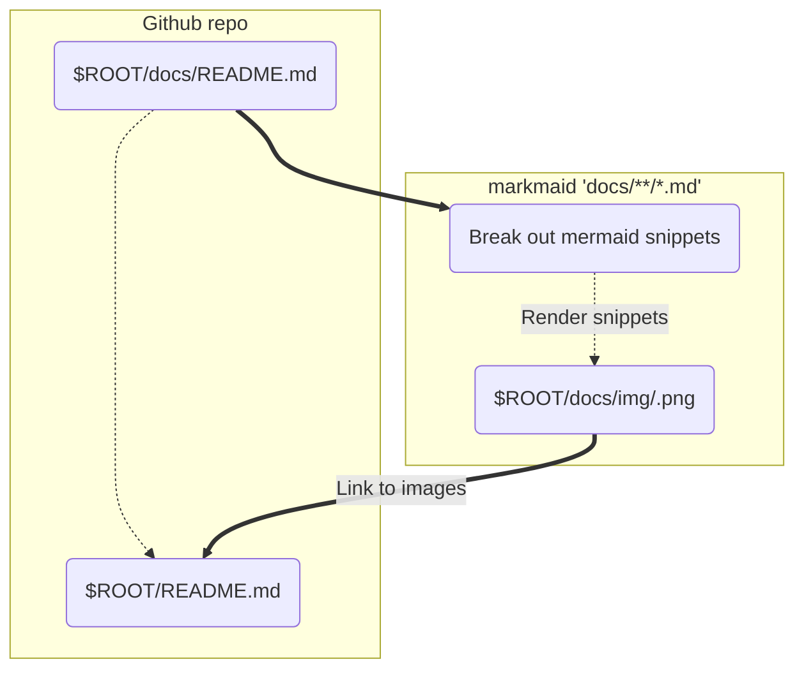

# markmaid

[](https://travis-ci.org/nicklasnygren/markmaid)

CLI tool to parse markdown files and renders [Mermaid](https://github.com/knsv/mermaid) snippets as images.

Requires Node 4.0 or greater.

## How it works

1. Create a readme file with mermaid code snippet (for example, see the [readme source for
   this project](docs/README.md)).
2. Run `markmaid [filename]`
3. Commit and push
4. View the rendered result in your Github docs



## Installation

Install the markmaid command line tool with npm:

```sh
npm install -g mermaid
```
